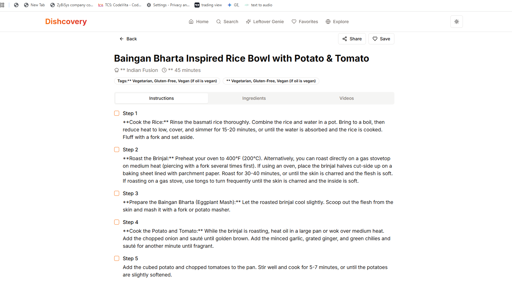
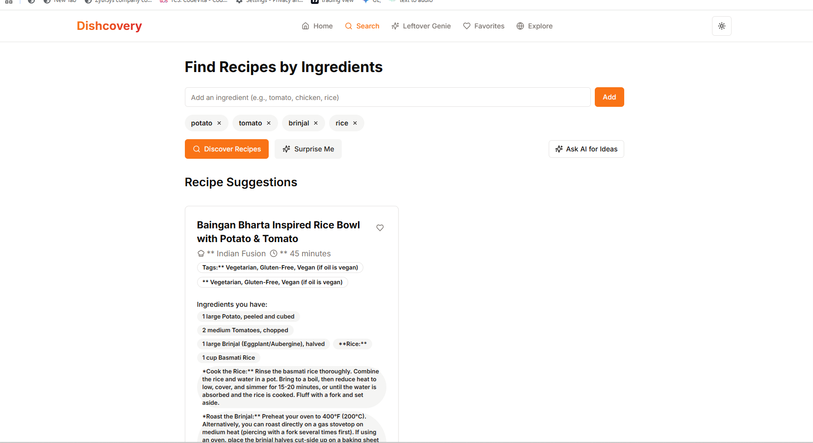
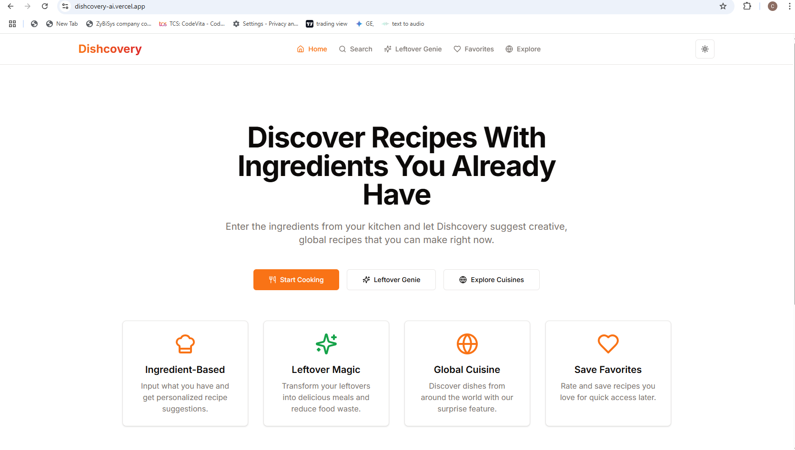
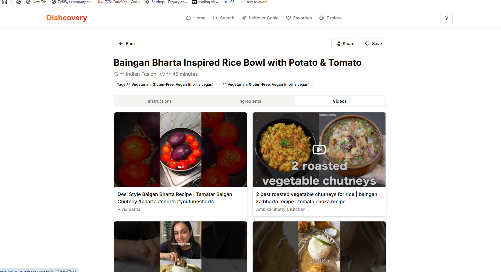
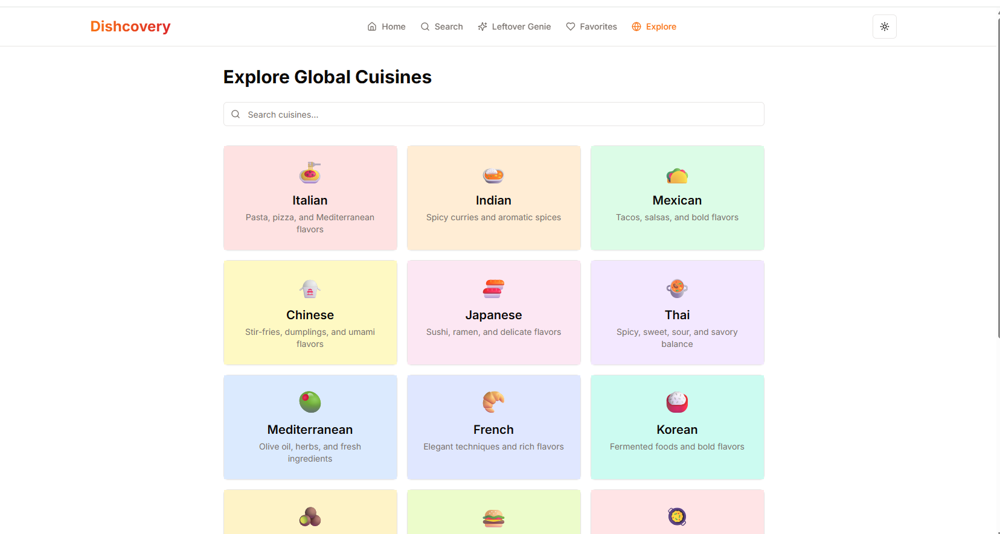

<div align="center">
  <!-- Replace with your actual logo if available, e.g.,  -->
  <h1>Dishcovery: Your Smart Recipe Finder</h1>
  <p>Discover Recipes With Ingredients You Already Have – Transform your kitchen with AI-powered meal ideas!</p>

  <p>
    <!-- Add your badges here if applicable, e.g., build status, contributors, stars, issues -->
    <!-- Example Badges (replace with your repo details): -->
    <!-- <a href="https://github.com/Devnaam/Dishcovery-Ai/actions/workflows/deploy.yml">
      
    </a>
    <a href="https://github.com/Devnaam/Dishcovery-Ai/graphs/contributors">
      
    </a>
    <a href="https://github.com/Devnaam/Dishcovery-Ai/stargazers">
      
    </a>
    <a href="https://github.com/Devnaam/Dishcovery-Ai/issues">
      
    </a> -->
  </p>

  <p>
    <a href="https://dishcovery-ai.vercel.app/" target="_blank">
      
    </a>
    <a href="https://github.com/Devnaam/Dishcovery-Ai" target="_blank">
      
    </a>
  </p>
</div>

---

## 🚀 About the Project

**Dishcovery** is an intelligent web application that revolutionizes the way you cook. Forget endless grocery lists! Simply enter the ingredients you already have in your kitchen, and let Dishcovery suggest creative, delicious, and global recipes you can make right now. Our AI-powered platform helps you minimize food waste and discover new culinary adventures with ease.

---

## ✨ Key Features

Dishcovery comes packed with features to enhance your cooking experience:

- 🍳 **Ingredient-Based Suggestions:** Input the ingredients you have on hand and get personalized recipe suggestions tailored to your pantry.

- 🍝 **Leftover Magic:** Transform your leftovers into exciting new meals, helping you reduce food waste and get the most out of every ingredient.

- 🌍 **Global Cuisine Explorer:** Discover dishes from around the world with our unique "surprise me" feature, expanding your culinary horizons.

- ❤️ **Save Favorites:** Easily rate and save your most loved recipes for quick access whenever you want to recreate a delicious meal.

---

## 💻 Tech Stack

Dishcovery leverages a modern and efficient technology stack to deliver a seamless user experience:

| Layer          | Technology                                                                                                                                                                                                                 |
| :------------- | :------------------------------------------------------------------------------------------------------------------------------------------------------------------------------------------------------------------------- |
| **Frontend**   |   |
| **State Mgmt** |                                                                                                              |
| **AI Backend** |  (v1beta - gemini-2.0-flash)                                                                    |

---

## 📸 Screenshots or GIFs

To provide a visual overview of Dishcovery's interface and functionality, please add screenshots or GIFs here.

Example:

```markdown





```

_Replace the placeholder image paths with actual paths to your screenshots or GIFs._

---

## ⚙️ Installation / Run Locally

To get Dishcovery up and running on your local machine, follow these steps:

1.  **Clone the repository:**

    ```bash
    git clone [https://github.com/Devnaam/Dishcovery-Ai.git](https://github.com/Devnaam/Dishcovery-Ai.git)
    cd Dishcovery-Ai
    ```

2.  **Install dependencies:**

    ```bash
    npm install
    # or
    yarn install
    ```

3.  **Set up environment variables:**
    Create a `.env` file in the root directory and add your Google Gemini API key:

    ```
    VITE_GEMINI_API_KEY=YOUR_GEMINI_API_KEY
    ```

    You can get your Gemini API key from [Google AI Studio](https://aistudio.google.com/app/apikey).

4.  **Start the development server:**
    ```bash
    npm run dev
    # or
    yarn dev
    ```
    The application should now be running at `http://localhost:5173` (or another port if 5173 is in use).

---

## 🤖 API Integration (Gemini)

Dishcovery extensively utilizes the **Google Gemini API (v1beta - `gemini-2.0-flash`)** to power its intelligent recipe suggestions. The Gemini API is central to:

- **Ingredient-Based Recipe Generation:** Dynamically creating recipe suggestions based on user-provided ingredients.
- **Leftover Transformation:** Generating creative ideas for transforming leftover ingredients into new meals.
- **Global Cuisine Discovery:** Powering the "surprise me" feature to suggest diverse dishes from around the world.

The Gemini API ensures that Dishcovery provides smart, contextual, and inspiring recipe ideas tailored to your needs.

---

## 📞 Contact

Feel free to connect with me!

- **Name:** Devnaam Priyadershi
- **GitHub:** [Devnaam](https://github.com/Devnaam)
- **LinkedIn:** [Raj Priyadershi](https://www.linkedin.com/in/raj-priyadershi-56a256282/)
- **Personal Portfolio:** [devnaam4s.vercel.app](https://devnaam4s.vercel.app/)

---

## 📄 License

_it free u can download and edit it_

---
